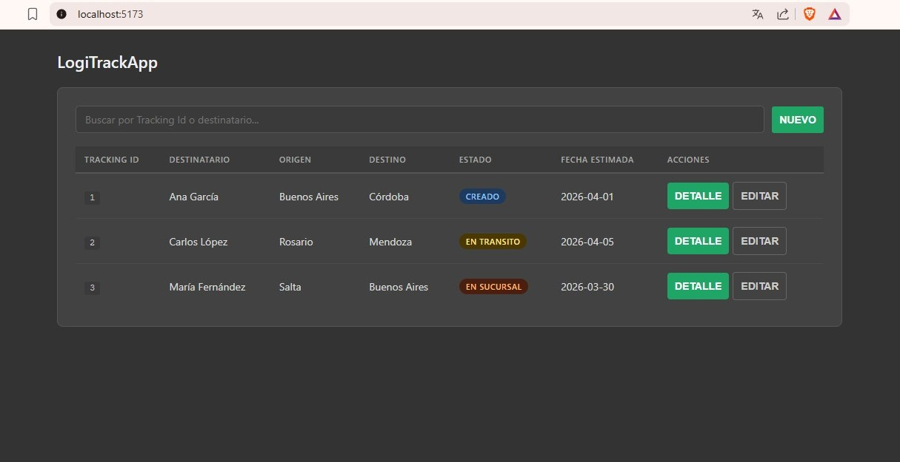

# LogiTrack

Sistema de Gestión de Logística que permite registrar, seguir y analizar envíos desde su creación hasta la entrega final. Con un enfoque MVP incremental, LogiTrack ofrece trazabilidad completa, auditoría de estados y un prototipo de Machine Learning que sugiere prioridades de envío.

**Nota:** ***El sistema opera con datos simulados. No incluye rutas reales, geolocalización ni integración con couriers.***

 
 

## Funciones

* **Gestión de envíos:** Registro completo con remitente, destinario, dirección de entrega y fecha estimada. Asignación automática de Tracking ID único.
* **Seguimiento y auditoría:** Cambio de estados con registro de fecha, hora y usuario responsable.
* **Búsqueda y listado:** Lista ordenada de envíos + búsqueda por Tracking ID o destinario.
* **Roles simulados:** Operador (gestión diaria) y Supervisor (métricas, reportes).
* **Machine Learning (prototipo):** Clasificador (Random Forest) que asigna prioridad Alta/Media/Baja a cada envío según distancia, restricciones y saturación simulada.
* **Protección de datos:** Diseño alineado con Ley 25.326 Argentina.

## Desarrollo
### Estructura del proyecto
- /.github : flujo de trabajo
- /docs: documentación del proyecto
- /src: código fuente
- /tests: pruebas y scripts

### Flujo de trabajo
La rama main representa el estado estable del proyecto.
Todo desarrollo se realiza en ramas separadas y se incorpora a main mediante Pull Requests.

Este proyecto fue desarrollado por [Joaquin Garcia](https://github.com/Joaquin1128), [Augusto Orozco](https://github.com/augusto951) y [Karen Rea](https://github.com/reakaren) para la materia ***Proyecto Profesional 1*** de la UNGS.